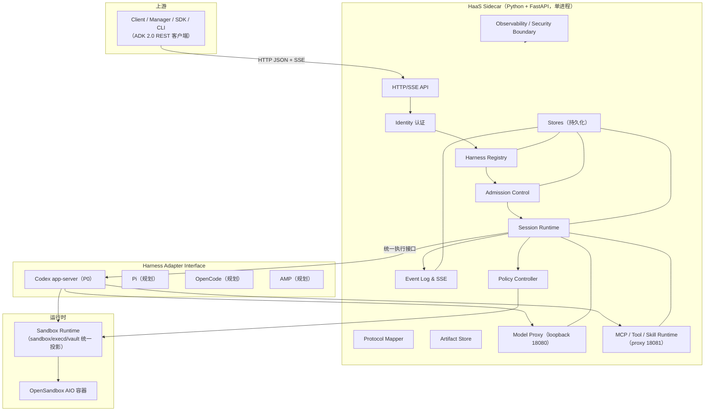
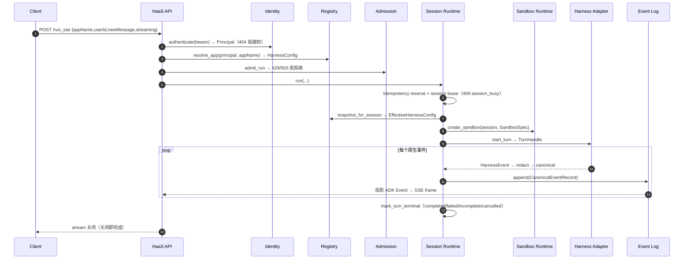

# Harness As A Service (HaaS)

> 多 harness 的运行托管 sidecar：对上提供稳定的 ADK 2.0 HTTP/SSE 协议，对下纳管
> Codex / Pi / OpenCode / AMP 等 agent harness，统一隔离模型、事件、凭据与可观测性。

**当前状态**：设计与协议/spec 阶段，运行时代码尚未初始化（roadmap 处于 S0）。

---

## 目录

1. [定位与背景](#1-定位与背景)
2. [核心原则](#2-核心原则)
3. [架构总览](#3-架构总览)
4. [请求时序](#4-请求时序)
5. [沙箱标准化](#5-沙箱标准化)
6. [API 面](#6-api-面)
7. [对象模型](#7-对象模型)
8. [端口约定](#8-端口约定)
9. [组件地图](#9-组件地图)
10. [仓库结构](#10-仓库结构)
11. [路线图](#11-路线图)
12. [开发与门禁](#12-开发与门禁)
13. [阅读顺序](#13-阅读顺序)

---

## 1. 定位与背景

HaaS 是 `mpa-codex-worker` 的重构升级方向。旧项目只服务 Codex；HaaS 把边界
放大为**多 harness 服务化**：

| 需求 | HaaS 的应对 |
|------|------------|
| 标准化任意 harness 的 API | Northbound 统一为 ADK 2.0 REST API 协议层 |
| 屏蔽底层 harness 接入差异 | Harness Adapter 是原生协议唯一 owner，上游只见 canonical 事件/错误 |
| harness 服务化能力 | Admission Control（配额/限流/队列）+ 幂等 + session 冻结快照 + 恢复 |
| 多 harness 运行环境标准化 | Sandbox Runtime 把各 harness sandbox 统一投影到 OpenSandbox |

**关键边界**：HaaS 只适配 ADK 2.0 的 **REST API 协议层**（HTTP 路径、请求/响应
shape、`Event` shape、SSE framing、camelCase），不引入 ADK 执行引擎
（`BaseAgent`/WorkflowGraph）、图工作流或 ADK Web UI。

## 2. 核心原则

1. **协议优先**：上游只依赖 ADK 2.0 协议，不依赖任何 harness 原生协议。
2. **适配器隔离**：Codex JSON-RPC、Pi JSONL、OpenCode JSON 等原生细节只存在于对应 adapter。
3. **事件是事实，不是渲染**：SSE 表达发生了什么，不表达 UI 怎么画。
4. **Secretless 是硬边界**：真实 key/Authorization/presigned URL/raw prompt 不得进入
   env、日志、事件、artifact，也不得进入 git（pre-commit 拦截）。
5. **失败可恢复或可解释**：timeout/cancel/crash/断线都有明确状态、错误码与恢复动作。
6. **最小必要抽象**：adapter 接口与 Sandbox Runtime 是必要抽象；不引入预防性层。

> 完整铁律见 [AGENTS.md](AGENTS.md)。

## 3. 架构总览



分层职责一句话：

| 层 | 职责 |
|----|------|
| Protocol Mapper | ADK camelCase ↔ 内部对象，事件投影，legacy shim 翻译 |
| Identity / Registry / Session / Admission / EventLog | 服务化控制面 |
| Stores | 唯一持久事实源（session/event/idempotency/registry/admission） |
| Harness Adapter | 原生协议归一化（唯一 owner） |
| Sandbox Runtime | 统一隔离投影到 OpenSandbox |
| OpenSandbox AIO | 基础 shell/file/sandbox/execd/vault 服务 |

## 4. 请求时序

`POST /run_sse`（流式运行）的完整时序，对象级细节见
[WALKTHROUGH](specs/architecture/WALKTHROUGH.md)：



## 5. 沙箱标准化

Sandbox Runtime 是多 harness 运行环境标准化的承载体：Policy Controller 的
workspace/network/tool 策略 + adapter 的 sandbox 声明 → 统一投影为 OpenSandbox
的 sandbox/execd/credential vault 配置。harness 自带的 sandbox（如 Codex sandbox）
只作为内层，外层由 OpenSandbox 接管。详见
[sandbox-runtime](specs/sandbox-runtime/README.md)。

## 6. API 面

Northbound 分三层，schema 唯一来源
[haas-2026-08-26.openapi.yaml](specs/haas-protocol/haas-2026-08-26.openapi.yaml)，
错误码唯一来源 [ERROR-CODES.md](specs/haas-protocol/ERROR-CODES.md)。

### 6.1 ADK-Compatible（主协议，drop-in）

| Method | Path | 说明 |
|--------|------|------|
| GET | `/list-apps` | 列出 caller scope 内 configured harness（app 名数组） |
| POST | `/run` | 运行 harness，一次性返回事件 JSON 数组 |
| POST | `/run_sse` | 运行 harness，SSE 流式事件；`streaming:true` token 级增量 |
| GET | `/apps/{app}/users/{user}/sessions/{sid}` | 读 session（state + events） |
| PATCH | `/apps/{app}/users/{user}/sessions/{sid}` | `stateDelta` 更新（deep-merge） |
| DELETE | `/apps/{app}/users/{user}/sessions/{sid}` | 删除 session |

`appName` = configured harness `id`（`chrn_...`，`name` 可作别名）。

### 6.2 HaaS Native（控制面扩展）

`/v1/haas/health|ready|status|diagnostics`、harness CRUD、模型发现、session/event
list、invocation cancel、artifact upload/download/archive。完整列表见
[haas-protocol §5.2](specs/haas-protocol/README.md)。

### 6.3 Legacy Shim（仅迁移）

`/v1/codex-worker/*` 映射到 HaaS 对象，带 deprecation notice。

### 6.4 内部 loopback（不对外）

| 服务 | 端口 | 端点 | 定义位置 |
|------|------|------|----------|
| Model Proxy | 18080 | `/v1/responses`、`/v1/chat/completions`、`/v1/models`、`/health`、`/ready` | [model-proxy](specs/model-proxy/README.md) |
| MCP Proxy | 18081 | `/mcp`、`/sse`、`/health`、`/ready` | [mcp-tool-skill-runtime](specs/mcp-tool-skill-runtime/README.md) |

### 6.5 统一约定

- **字段命名**：ADK 面 camelCase；HaaS native 面用 HaaS envelope（`{data, traceId}`）。
- **错误**：`{detail, haasError:{type,code,param,safeReason,retryable,traceId}}`，code 全表见 ERROR-CODES。
- **时间戳**：ADK 公开面 float 秒 epoch；内部毫秒 epoch；投影层转换。
- **幂等**：mutating API 支持 `Idempotency-Key`（可选，服务端去重）。

## 7. 对象模型

| 对象 | id 前缀 | authority |
|------|---------|-----------|
| harness（ADK app） | `chrn_` | Harness Registry |
| session | caller-supplied（默认 `hsess_`） | Session Runtime |
| invocation | `inv_` | Session Runtime |
| turn（内部） | `turn_` | Session Runtime |
| container | `cntr_` | Container Runtime |
| file | `file_` | Artifact Store |
| event | `evt_`（invocation-scoped） | Event Log |

## 8. 端口约定

| 端口 | 归属 | 用途 |
|------|------|------|
| 8080 | OpenSandbox AIO | shell/file/browser/sandbox/execd/vault |
| 8092 | HaaS sidecar | ADK HTTP/SSE API |
| 18080 | model proxy | 仅 `127.0.0.1` |
| 18081 | MCP/tool proxy | 仅 `127.0.0.1` |

## 9. 组件地图

| 优先级 | 组件 | 职责 |
|--------|------|------|
| P0 | [architecture](specs/architecture/README.md)（+[WALKTHROUGH](specs/architecture/WALKTHROUGH.md)） | 分层、事实归属、端到端时序 |
| P0 | [haas-protocol](specs/haas-protocol/README.md) | ADK/控制面/legacy 三层协议，错误目录 |
| P0 | [harness-registry](specs/harness-registry/README.md) | configured harness、appName 解析、模型/provider |
| P0 | [harness-adapter](specs/harness-adapter/README.md) | 统一 adapter 接口 + 能力矩阵 |
| P0 | [codex-app-server-adapter](specs/codex-app-server-adapter/README.md) | 首期 Codex runtime |
| P0 | [session-runtime](specs/session-runtime/README.md) | session/invocation/turn 生命周期 |
| P0 | [admission-control](specs/admission-control/README.md) | 配额/限流/队列 |
| P0 | [event-log-sse](specs/event-log-sse/README.md) | 事件事实源 + SSE replay |
| P0 | [policy-controller](specs/policy-controller/README.md) | workspace/network/tool policy 编译 |
| P0 | [security-boundary](specs/security-boundary/README.md) | secretless、脱敏、SSRF、scope |
| P0 | [stores](specs/stores/README.md) | 持久化 + schema 迁移 |
| P0 | [identity](specs/identity/README.md) | bearer → principal、scope |
| P0 | [config](specs/config/README.md) | env/config 装配 |
| P1 | [sandbox-runtime](specs/sandbox-runtime/README.md) | 统一 sandbox/execd/vault 投影 |
| P1 | [model-proxy](specs/model-proxy/README.md) | OpenAI-compatible 中转、usage 归一 |
| P1 | [mcp-tool-skill-runtime](specs/mcp-tool-skill-runtime/README.md) | MCP proxy、tools、skills |
| P1 | [artifact-store](specs/artifact-store/README.md) | 输入文件、产物、下载归档 |
| P1 | [container-runtime](specs/container-runtime/README.md) | AIO 镜像、端口、health/ready、drain |
| P1 | [observability](specs/observability/README.md) | logs/metrics/trace/diagnostics |
| P1 | [implementation-roadmap](specs/implementation-roadmap/README.md) | S0-S7 阶段与准出 |

## 10. 仓库结构

```text
haas/
├── haas/                  # sidecar 源码（S1 起）
├── tests/                 # 单元/集成/E2E
├── specs/                 # 长期组件合同（当前唯一交付物）
│   ├── architecture/      #   分层 + WALKTHROUGH 时序
│   ├── haas-protocol/     #   OpenAPI + 错误码目录
│   └── <component>/       #   18 个组件 spec
├── scripts/quality/       # secret-scan、pre-commit、install-hooks
├── .githooks/             # pre-commit 拦截钩子（committed）
├── .pre-commit-config.yaml
├── Dockerfile             # S5 起，基于 OpenSandbox AIO
├── Makefile               # pre-commit / secret-scan / install-hooks
└── pyproject.toml         # S1 起
```

## 11. 路线图

| Stage | 内容 | 准出 |
|-------|------|------|
| S0 | specs 基线（当前） | specs/OpenAPI/错误目录自洽 |
| S1 | Python + FastAPI 骨架 + Makefile | 包可导入、app factory 启动 |
| S2 | ADK 协议 core | list-apps/run/run_sse/session 测试过 |
| S3 | fake adapter | 证明协议与 harness 解耦 |
| S4 | Codex adapter | 真实 handshake+turn E2E（铁律 #9 最小链路） |
| S5 | Sandbox Runtime + AIO 容器 | 投影验证 + image smoke |
| S6 | 扩展：model proxy/MCP/skills/artifacts/admission | 逐项过 |
| S7 | Pi/OpenCode/AMP adapter | 能力矩阵扩展 |

## 12. 开发与门禁

```bash
make install-hooks   # 安装 .git/hooks/pre-commit（secret scan 拦截）
make pre-commit      # whitespace + secret scan
make secret-scan     # 扫描暂存变更中的敏感信息
```

- 测试默认离线；真实 Codex/OpenSandbox/provider 用 `HAAS_E2E=1` 分项开关，未运行记 `not_run`。
- 覆盖率门禁：核心模块 ≥90%；credential/redaction/policy/proxy-token/artifact-path/日志脱敏 ≥95%。
- 提交安全：凭证/私钥/`.env`/证书/presigned URL/raw prompt 禁止进 git；命中 pre-commit 即拦截。
  仅测试 fixture 可用行内 `# haas-secret-ignore`，且需 code review。

## 13. 阅读顺序

1. 本 README（全局视图）
2. [specs/README.md](specs/README.md)（组件总览 + 全局约定）
3. [architecture/WALKTHROUGH.md](specs/architecture/WALKTHROUGH.md)（对象级时序）
4. [haas-protocol](specs/haas-protocol/README.md) + OpenAPI + ERROR-CODES（协议合同）
5. 按组件地图读各组件 spec（每个均有 11 节标准结构）
