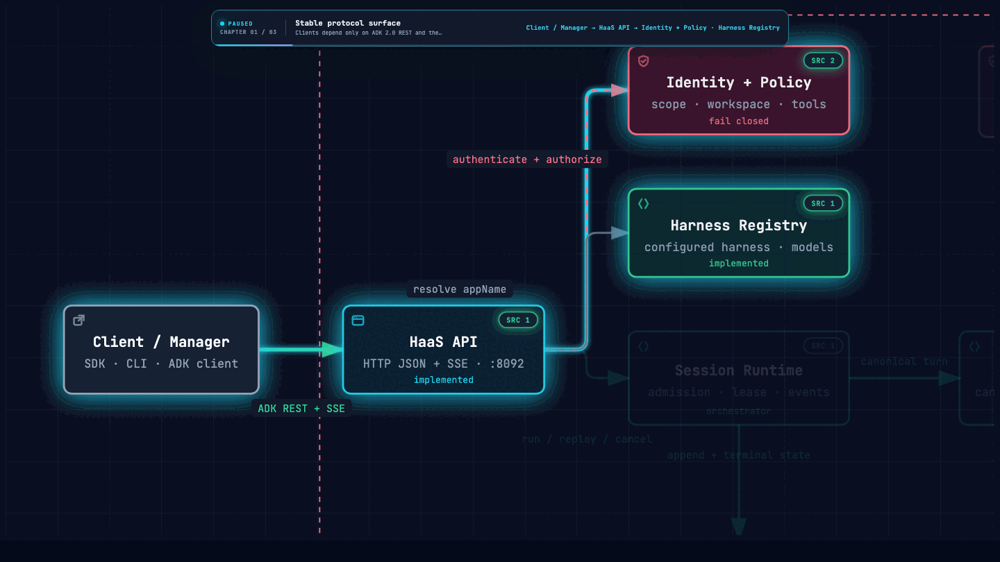
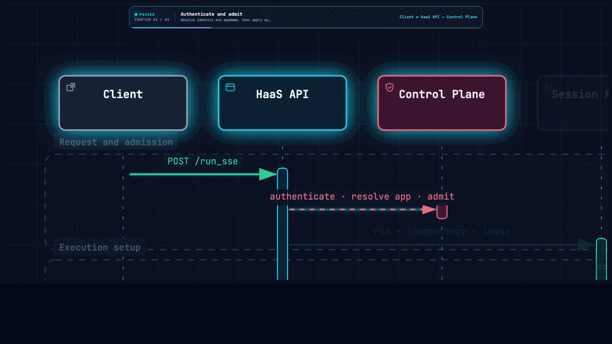
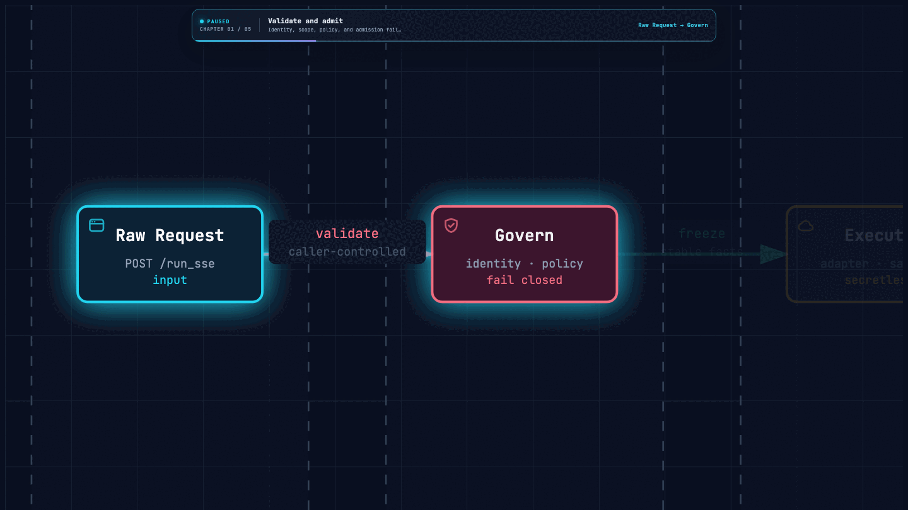
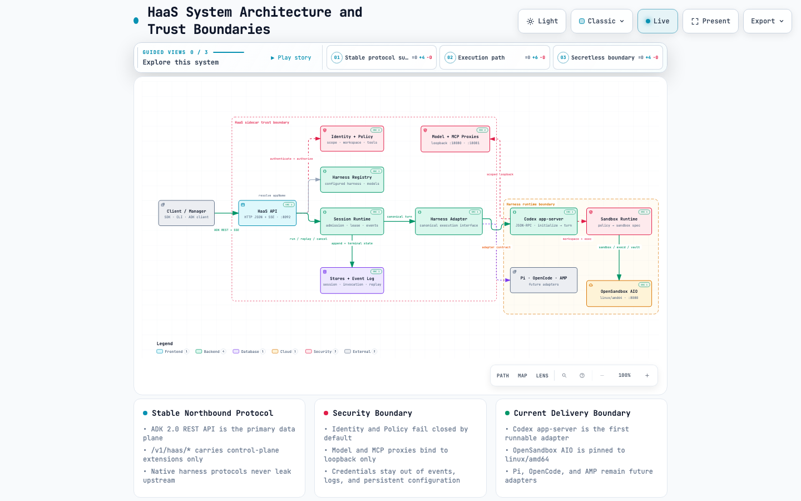
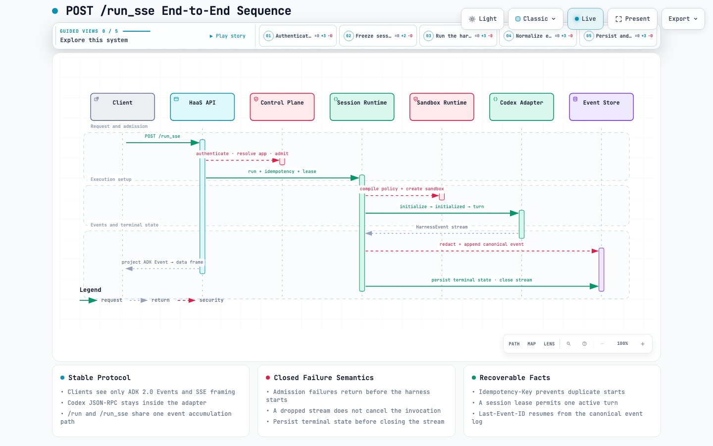

# Harness As A Service (HaaS)

**English** | [简体中文](README.zh-CN.md)

HaaS is a multi-harness runtime sidecar. It exposes a stable **Google ADK 2.0
REST API + SSE** surface while managing complete agent runtimes such as Codex,
Pi, OpenCode, and AMP behind adapters. Sessions, events, policies, sandboxes,
models, tools, and credentials share one service boundary.

> The repository currently includes the FastAPI sidecar, ADK protocol surface,
> session and event runtime, Codex app-server adapter, model proxy, MCP and skill
> support, artifact handling, policy enforcement, OpenSandbox integration, and
> the AIO container startup chain. Codex is the first implemented production
> adapter. Pi, OpenCode, and AMP remain planned. Real Codex, OpenSandbox, and
> provider checks are gated behind explicit E2E switches.

## HaaS in 30 seconds

### One protocol, isolated runtimes

[](docs/architecture/haas-system.html)

Clients use one ADK-compatible surface while HaaS isolates policy, sessions,
native harness protocols, credentials, and sandbox execution behind adapters.

### From `POST /run_sse` to terminal state

[](docs/architecture/run-sse.html)

Admission, idempotency, leases, Codex execution, canonical events, and terminal
state form one ordered request path.

### Safe in, canonical through, recoverable out

[](docs/architecture/request-processing.html)

Every request is governed before execution, normalized and redacted before
persistence, then projected as live or replayed ADK Events. Click any animation
to open its interactive Archify walkthrough.

## Why HaaS

Each agent harness has its own session, tool, file, approval, event, and recovery
semantics. HaaS keeps those differences inside adapters so clients depend on one
stable service contract.

| Problem | HaaS boundary |
|---|---|
| Every harness exposes a different API | The northbound surface follows the ADK 2.0 REST API contract |
| Native events and errors are not portable | Adapters normalize them into canonical events, then project ADK Events |
| Concurrent runs can duplicate or overwrite work | Idempotency, admission control, session leases, and terminal states |
| Credentials can leak into harness configuration and logs | Loopback proxies, runtime tokens, credential vaults, and redaction |
| Runtime isolation differs across harnesses | Policy Controller projects constraints into OpenSandbox AIO |

HaaS implements only the ADK 2.0 **REST API protocol layer**. It does not embed
the ADK execution engine, graph workflows, BaseAgent / WorkflowGraph, or ADK Web
UI. The legacy /v1/codex-worker/* migration shim is explicitly out of scope.

## System architecture

[](docs/architecture/haas-system.html)

Open the interactive version by clicking the image. It supports light and dark
themes, component focus, relationship search, and export.
[View the JSON source](docs/architecture/haas-system.architecture.json) ·
[中文架构图](docs/architecture/haas-system.zh-CN.html).

The architecture follows four dependency rules:

1. Clients depend only on the ADK-compatible API and the /v1/haas/* control plane.
2. Session Runtime coordinates admission, leases, configuration snapshots, turns,
   and canonical events. Stores own session, invocation, event, and idempotency facts.
3. Native harness protocols exist only inside their adapters. The Codex adapter
   uses app-server JSON-RPC and enforces initialize → initialized → thread/turn.
4. Policy, model credentials, and tool credentials stay inside the sidecar trust
   boundary. Harnesses receive only loopback proxy access or scoped runtime handles,
   while OpenSandbox AIO provides the outer execution boundary.

### Current capability boundary

| Capability | Status | Main surface |
|---|---|---|
| ADK-compatible API | Implemented | /list-apps, /run, /run_sse, session CRUD |
| HaaS control plane | Implemented | Harness CRUD, session/event lists, cancel, files/artifacts, status/diagnostics |
| Sessions and events | Implemented | Idempotency, leases, canonical events, replay, terminal states |
| Codex app-server | Implemented | WebSocket / Unix socket / stdio transports, schema drift, cancel/recovery |
| Policy and security | Implemented | Workspace/network/tool policy, SSRF and path traversal protection, redaction |
| Model / MCP / skills | Foundation implemented | Loopback model proxy, MCP validation, skill materialization |
| OpenSandbox AIO | Foundation implemented | Sandbox policy projection, AIO-derived linux/amd64 image, health/ready |
| Pi / OpenCode / AMP | Planned | Reuse the Harness Adapter contract without changing the northbound API |

## /run_sse request flow

[](docs/architecture/run-sse.html)

Open the interactive sequence by clicking the image. See the
[architecture walkthrough](specs/architecture/WALKTHROUGH.md) for the complete
object-level flow and [run-sse.sequence.json](docs/architecture/run-sse.sequence.json)
for the diagram source. [中文时序图](docs/architecture/run-sse.zh-CN.html).

Key runtime semantics:

- Admission failures return a structured haasError before a harness starts.
- Idempotency-Key prevents duplicate starts; a session lease permits one active turn.
- Native events are redacted and appended to the canonical event log before ADK projection.
- /run and /run_sse use the same event accumulation path and differ only in delivery timing.
- An SSE disconnect does not cancel the invocation. Last-Event-ID resumes from the event log.
- Every invocation converges on completed, failed, incomplete, or cancelled; the
  terminal state is persisted before the stream closes.

## APIs and ports

### ADK-compatible data plane

| Method | Path | Purpose |
|---|---|---|
| GET | /list-apps | List configured harnesses visible to the caller |
| POST | /run | Execute and return the ADK Event array when complete |
| POST | /run_sse | Execute and stream text/event-stream frames |
| GET/PATCH/DELETE | /apps/{app}/users/{user}/sessions/{sid} | Read, merge state into, or delete a session |

appName identifies a configured harness (chrn_...); name may be used as an alias.
The [OpenAPI document](specs/haas-protocol/haas-2026-08-26.openapi.yaml) is the
schema source of truth. See [ERROR-CODES.md](specs/haas-protocol/ERROR-CODES.md)
for the error catalog.

### HaaS control plane

/v1/haas/* provides health, readiness, status, diagnostics, harness CRUD, model
discovery, session and event management, invocation cancellation, and artifact
upload, download, and archive operations.

| Port | Service | Exposure |
|---:|---|---|
| 8080 | OpenSandbox AIO / unified container entrypoint | Container entrypoint |
| 8092 | HaaS sidecar HTTP/SSE | Internal sidecar listener |
| 18080 | Model proxy | 127.0.0.1 only |
| 18081 | MCP/tool proxy | 127.0.0.1 only |

/health reports process liveness. /ready reports whether the selected adapter can
accept execution. They are intentionally separate signals.

## Local development

Requirements: Python 3.12+ and [uv](https://docs.astral.sh/uv/). Container
verification also requires Docker and buildx/QEMU to build and run linux/amd64 on
Apple Silicon.

```bash
make setup

# Start without a real Codex runtime.
HAAS_ADAPTER_BASE=fake uv run --extra dev \
  uvicorn haas.config:create_app --factory --host 127.0.0.1 --port 8092

curl http://127.0.0.1:8092/health
curl -H 'Authorization: Bearer dev-token' \
  http://127.0.0.1:8092/list-apps
```

Production assembly selects the Codex adapter by default and connects to
/tmp/haas/codex.sock over a Unix socket. Real execution requires the selected
adapter to pass its readiness probe.

## Verification and containers

```bash
make test-fast          # Fast offline unit tests
make test-integration   # API / SSE / session / adapter integration tests
make adk-compat         # ADK 2.0 protocol compatibility tests
make lint               # Ruff
make type               # mypy --strict
make coverage           # Coverage gates
make docker-check       # Fast static container-contract checks
make full-check         # Complete local release gate
```

Real Codex, OpenSandbox, and provider tests are disabled by default. Enable them
with HAAS_E2E=1 or a component-specific switch. A disabled test must be reported
as not_run, not passed. Run a real Docker build and smoke test with:

```bash
HAAS_DOCKER_BUILD=1 make docker-check
```

All images must explicitly build and run as linux/amd64. The default base image
is digest-pinned. Use make docker-build so the host architecture never silently
changes the deliverable.

## Repository layout

```text
haas/
├── haas/                    # FastAPI sidecar and runtime implementation
│   ├── harnesses/           # Adapter contract, fake adapter, Codex app-server
│   ├── model_proxy/         # Secretless model relay
│   ├── mcp/                 # MCP/tool/skill materialization
│   ├── policy/              # Effective policy compilation and authorization
│   ├── runtime/             # OpenSandbox policy projection
│   ├── stores/              # Session/event/idempotency facts
│   └── security/            # Redaction and URL/path safety
├── tests/                   # Unit / integration / E2E / ADK compatibility
├── specs/                   # Long-lived component contracts and OpenAPI
├── docs/architecture/       # Archify sources, interactive HTML, static previews
├── docker/                  # Nginx, supervisor, and entrypoint configuration
├── scripts/quality/         # Local gates and Docker smoke checks
├── Dockerfile
├── Makefile
└── pyproject.toml
```

## Specification map

Recommended reading order:

1. [specs/README.md](specs/README.md): component index and global conventions.
2. [architecture](specs/architecture/README.md) and
   [WALKTHROUGH](specs/architecture/WALKTHROUGH.md): boundaries, fact ownership,
   and the complete request sequence.
3. [haas-protocol](specs/haas-protocol/README.md): ADK and HaaS native contracts.
4. [harness-adapter](specs/harness-adapter/README.md) and
   [codex-app-server-adapter](specs/codex-app-server-adapter/README.md): the adapter
   seam and first implementation.
5. [session-runtime](specs/session-runtime/README.md),
   [event-log-sse](specs/event-log-sse/README.md), and
   [security-boundary](specs/security-boundary/README.md): execution facts,
   recovery, and security boundaries.
6. [container-runtime](specs/container-runtime/README.md),
   [startup](specs/startup/README.md), and [runtime-trim](specs/runtime-trim/README.md):
   OpenSandbox AIO image, startup, and trimming contracts.

## Development rules

- specs/ contains the long-lived component contracts. Update the relevant spec
  before changing a protocol, state machine, error code, or component behavior.
- Public HTTP/SSE APIs, event names, headers, IDs, and configuration fields are
  compatibility surfaces. Semantic changes or removal require versioning,
  migration, retirement criteria, and rollback.
- Real credentials, Authorization, cookies, presigned URLs, raw prompts, and full
  tool arguments must never enter Git, logs, events, metrics, or artifact metadata.
- Run make pre-commit before committing. Escalate cross-component and container
  changes to make full-check and a real Docker smoke test.

See [AGENTS.md](AGENTS.md) for the complete development and security gates.
