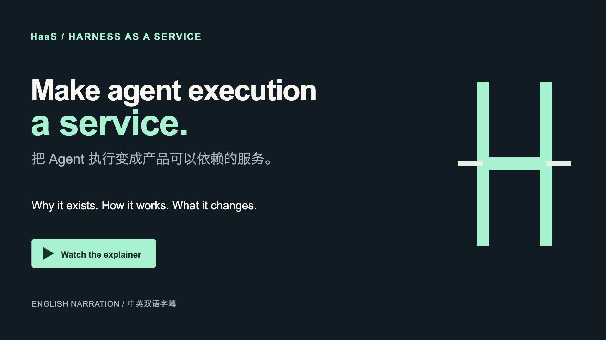
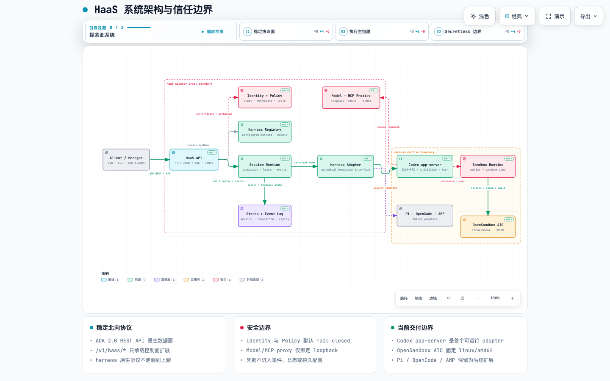
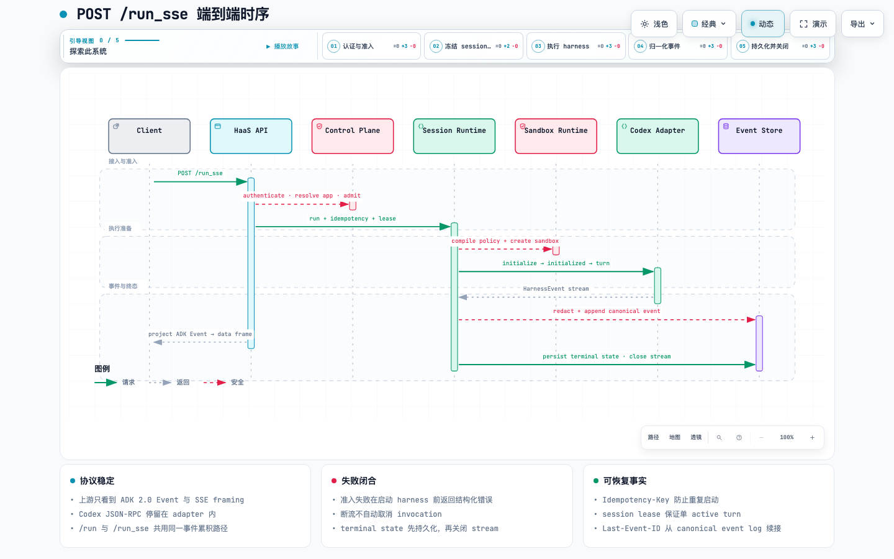

<div align="center">
  
  <p><strong>一套稳定协议，隔离多种 Agent Runtime。</strong></p>
  <p>
    <a href="https://github.com/superops-team/haas/actions/workflows/repository-metrics.yml"></a>
    <a href="specs/architecture/BRAND-AND-REPOSITORY-METRICS.zh-CN.md"></a>
    <a href="specs/architecture/BRAND-AND-REPOSITORY-METRICS.zh-CN.md"></a>
    <a href="specs/architecture/BRAND-AND-REPOSITORY-METRICS.zh-CN.md"></a>
  </p>
  <p><a href="README.md">English</a> · <strong>简体中文</strong></p>
</div>

HaaS 是一个多 harness 运行托管 sidecar：对上提供稳定的 **Google ADK 2.0
REST API + SSE**，对下通过 adapter 纳管 Codex、Pi、OpenCode、AMP 等完整 agent
runtime，并统一处理 session、事件、策略、sandbox、模型与工具凭据。

> 当前仓库已具备 FastAPI sidecar、ADK 协议面、session/event runtime、Codex
> app-server adapter、model proxy、MCP/skill、artifact、policy、OpenSandbox runtime
> 和 AIO 容器启动链路。Codex 是当前首个实现的生产 adapter；Pi、OpenCode 和 AMP
> 仍处于规划阶段。真实 Codex/OpenSandbox/provider 验证由显式 E2E 开关控制。

## 在 macOS 安装 OpenHarness

OpenHarness v0.2.1 当前提供 Apple Silicon macOS 版本。复制并执行以下命令即可安装：

```bash
curl -fsSL https://raw.githubusercontent.com/superops-team/haas/v0.2.1/scripts/install.sh | VERSION=v0.2.1 sh
```

带版本的安装器会从同一个 GitHub Release 下载 DMG 和 SHA-256 文件，在挂载前完成
校验，然后安装到 `/Applications`，并且只对 `OpenHarness.app` 移除
`com.apple.quarantine`。当前构建未签名；如果你的环境要求签名或公证，请先审阅脚本
再执行。替换失败时会恢复已有安装，安装完成后不会自动启动 App。

## 3 分钟了解 HaaS

### 观看 HaaS 项目讲解

[](https://www.youtube.com/watch?v=rmMq4Dpu-js)

这部约 2:57 的讲解视频说明 HaaS 为什么存在、服务边界如何工作、一次执行如何从
能力发现走到可回读的明确终态，以及部署与安全边界为什么必须保持清晰。视频采用
英语旁白，并烧录简体中文与英文字幕。

章节：**00:00** 真正的问题 · **00:20** Harness as a Service ·
**00:38** 一个服务边界 · **01:04** 跟随一次执行 · **01:30** 超越理想路径 ·
**01:54** 部署与真实边界 · **02:28** 构建真正的产品。

[在 YouTube 观看](https://www.youtube.com/watch?v=rmMq4Dpu-js) ·
[下载 MP4](https://github.com/superops-team/haas/releases/download/v0.2.1/haas-explainer-bilingual.mp4)

[探索交互式系统架构](docs/architecture/haas-system.zh-CN.html) ·
[跟随交互式 `/run_sse` 时序](docs/architecture/run-sse.zh-CN.html) ·
[查看安全请求加工过程](docs/architecture/request-processing.zh-CN.html)

## 为什么需要 HaaS

不同 agent harness 拥有各自的会话、工具、文件写入、审批、事件和恢复协议。
HaaS 把这些差异封装在 adapter 内，让上游只依赖稳定服务合同：

| 问题 | HaaS 的边界 |
|---|---|
| 每个 harness 都有不同 API | Northbound 统一为 ADK 2.0 REST API 协议层 |
| 原生事件和错误不可复用 | Adapter 归一为 canonical event，再投影为 ADK Event |
| 并发执行容易重复或互相覆盖 | Idempotency、admission control、session lease 与 terminal state |
| 凭据容易进入 harness 配置和日志 | Loopback proxy、runtime token、credential vault 与全链路脱敏 |
| 不同运行环境难以形成一致边界 | Policy Controller 将约束投影到 OpenSandbox AIO |

HaaS 只兼容 ADK 2.0 的 **REST API 协议层**，不引入 ADK 执行引擎、图工作流、
BaseAgent / WorkflowGraph 或 ADK Web UI。HaaS 专属控制面能力统一位于
`/v1/haas/*`。

## 系统架构

[](docs/architecture/haas-system.zh-CN.html)

点击图片打开可交互版本，可切换明暗主题、聚焦组件、搜索关系并导出图片。
[查看图源 JSON](docs/architecture/haas-system.zh-CN.architecture.json) ·
[English diagram](docs/architecture/haas-system.html)。

架构遵循四条依赖规则：

1. Client 只依赖 ADK-compatible API 与 /v1/haas/* 控制面。
2. Session Runtime 编排 admission、lease、配置快照、turn 和 canonical event；
   Stores 是 session、invocation、event 与幂等记录的事实源。
3. Harness 原生协议只能存在于对应 adapter 内。Codex adapter 当前使用 app-server
   JSON-RPC，并严格执行 initialize → initialized → thread/turn。
4. Policy、模型和工具凭据在 sidecar 信任边界内处理；harness 只访问 loopback proxy
   或 scoped runtime handle，外层执行隔离由 OpenSandbox AIO 承载。

### 当前能力边界

| 能力 | 当前状态 | 主要入口 |
|---|---|---|
| ADK-compatible API | 已实现 | /list-apps、/run、/run_sse、session CRUD |
| HaaS control plane | 已实现 | harness CRUD、session/event list、cancel、files/artifacts、status/diagnostics |
| Session 与事件 | 已实现 | idempotency、lease、canonical event、replay、terminal state |
| Codex app-server | 已实现 | WebSocket / Unix socket / stdio transport、schema drift、cancel/recovery |
| Policy 与 security | 已实现 | workspace/network/tool policy、SSRF/path traversal 防护、redaction |
| Model / MCP / skills | 已实现基础链路 | loopback model proxy、MCP 校验、skill materialization |
| Container runtime | AIO 基线已实现；Lite 仍为 spec-only | 当前已有 AIO linux/amd64 image 与 health/ready；默认 Lite linux/arm64+amd64 仍需实现和准出 |
| Pi / OpenCode / AMP | 规划中 | 复用 Harness Adapter contract，不改变 northbound API |

## /run_sse 请求链路

[](docs/architecture/run-sse.zh-CN.html)

点击图片打开可交互时序图；完整对象级步骤见
[architecture walkthrough](specs/architecture/WALKTHROUGH.zh-CN.md)，图源见
[run-sse.zh-CN.sequence.json](docs/architecture/run-sse.zh-CN.sequence.json) ·
[English diagram](docs/architecture/run-sse.html)。

关键运行语义：

- 准入失败在 harness 启动前返回结构化 haasError。
- Idempotency-Key 防止同一请求重复启动，session lease 保证单 active turn。
- 原生事件必须先脱敏并写入 canonical event log，再投影为 ADK Event/SSE frame。
- /run 与 /run_sse 共用同一事件累积路径，差异只在输出时机。
- SSE 断线不会自动取消 invocation；客户端可用 Last-Event-ID 回放后续接 live。
- invocation 必须收敛为 completed、failed、incomplete 或 cancelled，终态持久化后才关闭 stream。

## API 与端口

### ADK-compatible data plane

| Method | Path | 说明 |
|---|---|---|
| GET | /list-apps | 列出 caller scope 内 configured harness |
| POST | /run | 执行并一次性返回 ADK Event 数组 |
| POST | /run_sse | 执行并流式返回 text/event-stream |
| GET/PATCH/DELETE | /apps/{app}/users/{user}/sessions/{sid} | 读取、合并状态或删除 session |

appName 对应 configured harness id（chrn_...，name 可作为别名）。完整 schema 以
[OpenAPI](specs/haas-protocol/haas-2026-09-10.openapi.yaml) 为准，错误目录见
[ERROR-CODES.md](specs/haas-protocol/ERROR-CODES.zh-CN.md)。

### HaaS control plane

/v1/haas/* 提供 health/ready/status/diagnostics、harness CRUD、模型发现、
session/event 管理、invocation cancel、artifact upload/download/archive 等能力。

| 端口 | 服务 | 暴露范围 |
|---:|---|---|
| 8080 | OpenSandbox AIO / 容器统一入口 | 容器入口 |
| 8092 | HaaS sidecar HTTP/SSE | sidecar 内部监听 |
| 18080 | Model proxy | 127.0.0.1 only |
| 18081 | MCP/tool proxy | 127.0.0.1 only |

/health 只表示进程存活；/ready 表示当前 adapter 是否可接受执行，二者不能互换。

## 本地开发

需要 Python 3.12+、[uv](https://docs.astral.sh/uv/)；容器验证还需要 Docker +
buildx/QEMU（Apple Silicon 上用于构建和运行 linux/amd64）。

```bash
make setup

# 不依赖真实 Codex 的本地开发服务
HAAS_ADAPTER_BASE=fake uv run --extra dev \
  uvicorn haas.config:create_app --factory --host 127.0.0.1 --port 8092

curl http://127.0.0.1:8092/health
curl -H 'Authorization: Bearer dev-token' \
  http://127.0.0.1:8092/list-apps
```

生产装配默认使用 Codex adapter，并通过 Unix socket /tmp/haas/codex.sock 连接
app-server。真实运行需要先满足对应 adapter readiness。

## 验证与容器

```bash
make test-fast          # 快速离线单元测试
make test-integration   # API / SSE / session / adapter 集成测试
make adk-compat         # ADK 2.0 协议兼容性测试
make lint               # Ruff
make type               # mypy --strict
make coverage           # 覆盖率门禁
make docker-check       # 快速静态容器合同检查
make full-check         # 最终本机准出
```

真实 Codex/OpenSandbox/provider 测试默认关闭，使用 HAAS_E2E=1 或分项开关显式
启用；未启用时只能记录为 not_run。真实 Docker build + smoke 使用：

```bash
HAAS_DOCKER_BUILD=1 make docker-check
```

Lite 镜像发布 linux/arm64 与 linux/amd64，Mac Apple Silicon 用 Docker CLI 运行 arm64；AIO 仍只交付 linux/amd64。所有 release base/image manifest 必须 digest pin。
镜像构建统一走 make docker-build，不要让主机架构隐式决定交付产物。

## 仓库结构

```text
haas/
├── haas/                    # FastAPI sidecar 与 runtime 实现
│   ├── harnesses/           # adapter contract、fake 与 Codex app-server
│   ├── model_proxy/         # secretless model relay
│   ├── mcp/                 # MCP/tool/skill materialization
│   ├── policy/              # effective policy 编译与授权
│   ├── runtime/             # OpenSandbox policy projection
│   ├── stores/              # session/event/idempotency facts
│   └── security/            # redaction、URL/path safety
├── tests/                   # unit / integration / E2E / ADK compatibility
├── specs/                   # 长期组件合同与 OpenAPI
├── docs/architecture/       # Archify 图源、交互 HTML 与静态预览
├── docker/                  # nginx、supervisor、entrypoint
├── scripts/quality/         # 本机门禁与 Docker smoke
├── Dockerfile
├── Makefile
└── pyproject.toml
```

## 规格导航

建议按以下顺序阅读：

1. [specs/README.zh-CN.md](specs/README.zh-CN.md)：组件索引与全局约定。
2. [architecture](specs/architecture/README.zh-CN.md) 与
   [WALKTHROUGH](specs/architecture/WALKTHROUGH.zh-CN.md)：边界、事实归属、完整请求时序。
3. [haas-protocol](specs/haas-protocol/README.zh-CN.md)：ADK 与 HaaS native 协议合同。
4. [harness-adapter](specs/harness-adapter/README.zh-CN.md) 与
   [codex-app-server-adapter](specs/codex-app-server-adapter/README.zh-CN.md)：adapter seam 和首期实现。
5. [session-runtime](specs/session-runtime/README.zh-CN.md)、
   [event-log-sse](specs/event-log-sse/README.zh-CN.md)、
   [security-boundary](specs/security-boundary/README.zh-CN.md)：执行事实、恢复与安全边界。
6. [container-runtime](specs/container-runtime/README.zh-CN.md)、
   [startup](specs/startup/README.zh-CN.md)、[runtime-trim](specs/runtime-trim/README.zh-CN.md)：
   OpenSandbox AIO 镜像、启动和裁剪合同。

## 开发约束

- specs/ 是长期组件合同；协议、状态机、错误码或组件行为变化必须先更新 spec。
- 公共 HTTP/SSE API、事件名、Header、ID 与配置字段都是兼容面，只能做加法；
  改义或删除必须有版本、迁移、退休和回滚方案。
- 真实凭据、Authorization、cookie、presigned URL、raw prompt 和完整工具参数不得
  进入 git、日志、事件、metrics 或 artifact metadata。
- 提交前至少运行 make pre-commit；跨组件或容器变更按风险升级到
  make full-check 与真实 Docker smoke。

完整流程与安全门禁见 [AGENTS.md](AGENTS.md)。
